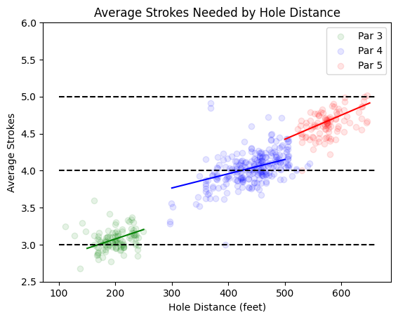

# driving
Modeling expected strokes as a function of tee distance from hole

## Results

The following figure shows separate linear fits to hole distance by hole type (par-3, -4, or -5).

The linear fits seem to mimic the piecewise regression done by [Broadie](http://www.columbia.edu/~mnb2/broadie/Assets/strokes_gained_pga_broadie_20110408.pdf) and, although separate models by hole type eliminates any information sharing across models, these fits do capture the different intercepts and slopes by hole type reasonably well.
